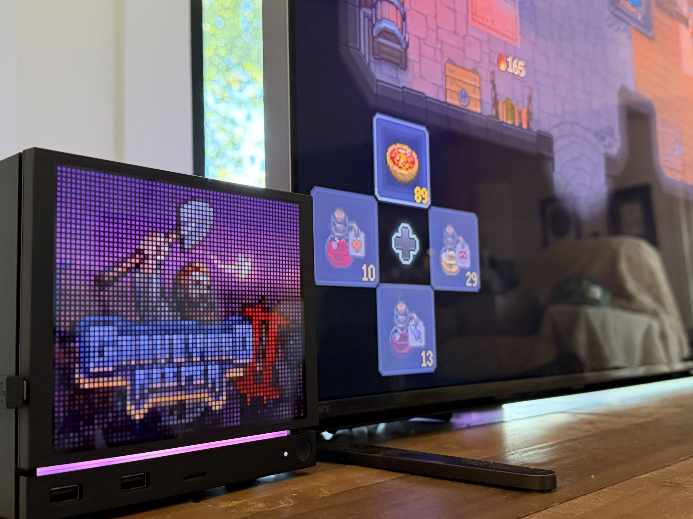
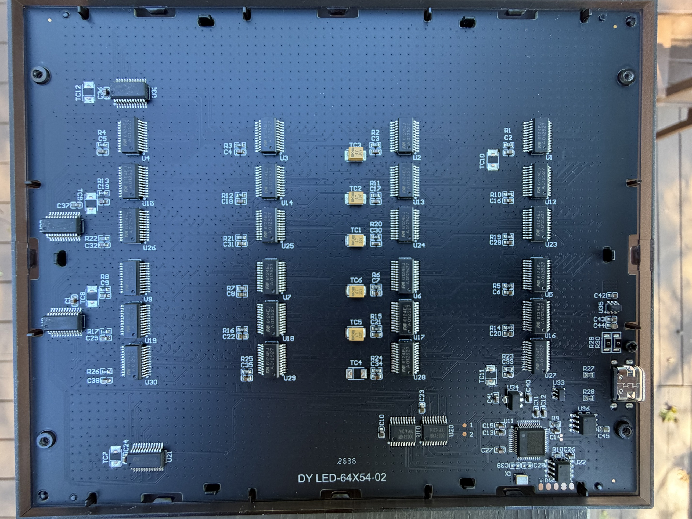
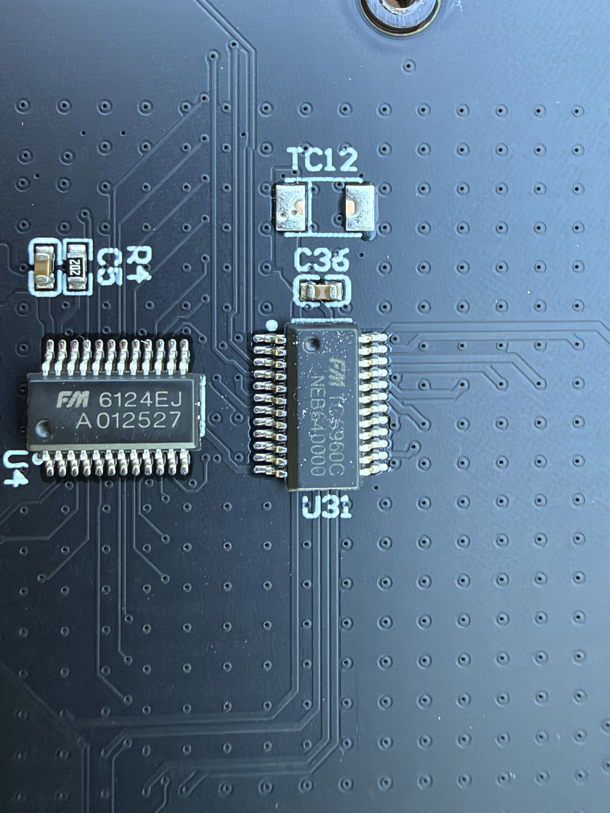
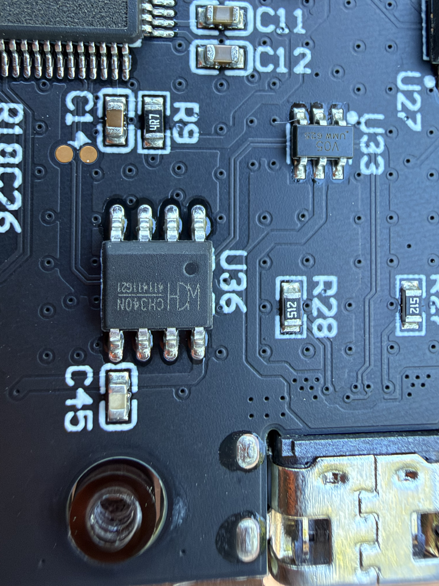
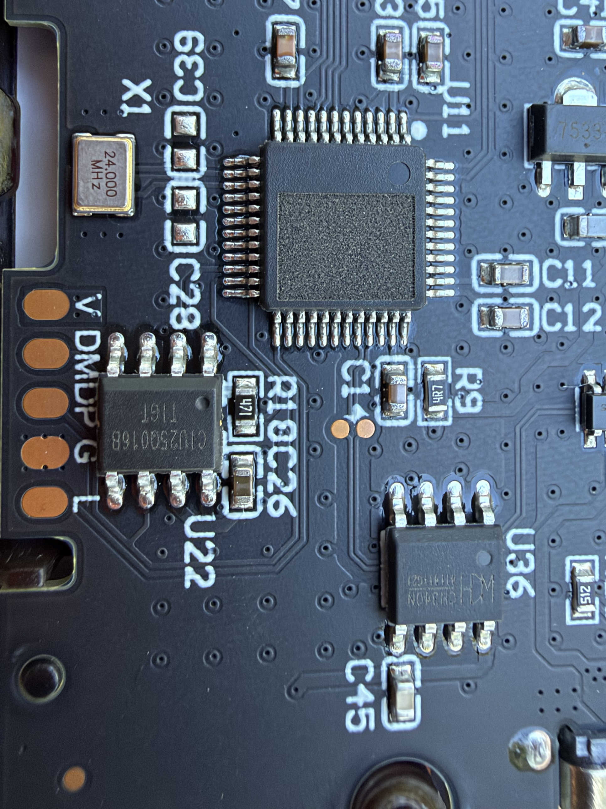
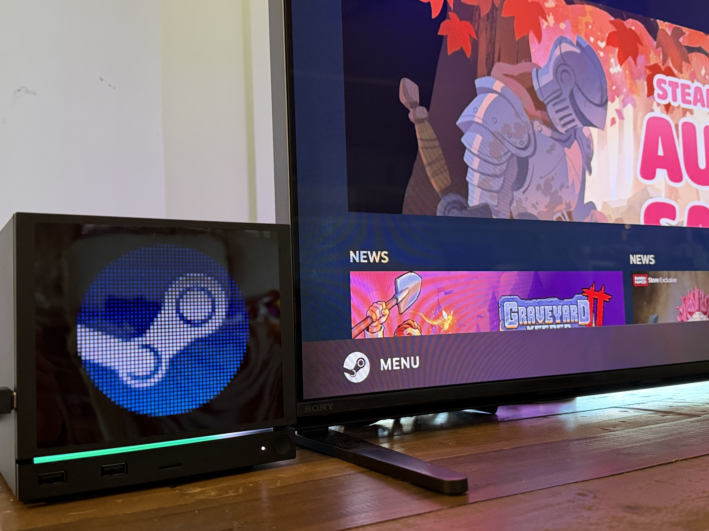

# Taking apart the JSAUX Pixel Matrix Faceplate

This is the long version of how I worked out what the [JSAUX Pixel Matrix Faceplate](https://jsaux.com/products/faceplate-for-steam-machine?variant=52269891813596) is and how it talks, and how I ended up writing my own Decky plugin for it. The protocol details are in [PROTOCOL.md](../PROTOCOL.md) and how to install the plugin is in the [README](../README.md). This page is the story, including the parts that went wrong.

## Why

The faceplate arrived with install instructions that go roughly like this: switch to Desktop Mode, run their Decky installer, copy a folder into `/home/deck`, double-click a `.desktop` file, approve an admin prompt. That gets you a background daemon, a desktop app and a Decky plugin. Before giving all of that root access to my Steam Machine I wanted to know what it does, so I read it first.

Some context on me: I'm old as dirt, I was a software engineer in a past life, and now I take gadgets apart for fun and write a lot of custom ESP32 firmware for smart home stuff around my house. I'm writing this up so the next person who wants to do something cool with this panel doesn't have to start from scratch.

## Reading their package

The download has three parts:

- `jsaux-matrix-daemon`, a Qt 6 program that owns the panel's serial port and serves an HTTP API on port 39052
- `jsaux-matrix-studio`, the desktop app, which only talks to the daemon over HTTP
- a Decky plugin, plain Python and JavaScript, which also mostly talks to the daemon

The Decky plugin is readable source, and the daemon still has its function names in it, so neither was hard to follow. Along the way I found a few things worth knowing:

- The Decky plugin's `plugin.json` lists its author as "OpenAI Codex".
- The plugin includes an "AI agent" screen. To show your usage on the panel, it reads your OpenAI/Codex login tokens from disk and refreshes them. That's a lot of access for a faceplate, and nothing in the install steps mentions it.
- The Japanese UI text calls the product a "128x128 matrix display". This panel is 64x54.
- The desktop app has a Firmware page that says "Firmware updates are not supported yet".

None of it looks malicious to me. It does look like software that shipped in a hurry.

The useful part was the serial code. The Python plugin has an old code path that talks to the panel directly, so the frame format was right there: a "DY" header, a type, a command, a length, the payload and a CRC-16. Pictures are uploaded as GIF files in 498-byte chunks. The daemon's `ProtocolCodec` class builds exactly seven kinds of frame, so that's everything their software can say to the panel.

## First contact

On the Steam Machine the faceplate shows up as a QinHeng CH340 USB serial adapter (`1a86:7523`) at `/dev/ttyUSB0`. SteamOS gives the logged-in user access to it, so no udev rules or root are needed. The baud rate is 1,000,000.

SteamOS has no pyserial, so I opened the port with Python's `termios` directly and wrote a small GIF encoder, since there's no Pillow either. The first upload, a solid red picture, worked: the panel answered every chunk and turned red. Color bars and a smooth gradient test followed. The panel shows smooth 64-step ramps in red, green, blue and white, so its color depth is better than I expected.

A few things only showed up by trying them:

- The panel answers with a status byte, and 01 means OK.
- Brightness never answers at all, but it works.
- When you start uploading a GIF the panel already has (same size and checksum), it answers 02 and skips the whole thing.

## It remembers everything

I tried streaming frames and got about 5 per second, and even a tiny GIF took around 200 ms. Something on the panel was slow, so I unplugged it to see what happened. It came back showing the last picture I'd sent.

That explains the slow part. Every upload is saved to flash, which is also why the faceplate showed a "system resources" screen with frozen numbers the first time I plugged it in, before I'd installed anything. The panel is built to work on its own, with the Steam Machine asleep or no software running.

To check that it really is flash, I timed the gap between the last chunk and the panel's "done" reply against the size of the GIF:

| GIF | bytes | 4 KB blocks | time to "done" |
|---|---|---|---|
| 1 flat frame | 891 | 1 | 129 ms |
| 12 flat frames | 2,205 | 1 | 146 ms |
| 48 flat frames | 6,417 | 2 | 230 ms |
| 1 noisy frame | 5,501 | 2 | 216 ms |
| 12 noisy frames | 57,813 | 15 | 1,238 ms |

The time follows the file size at about 80 ms per 4 KB, and doesn't care how many frames there are. That's what erasing and rewriting flash a sector at a time looks like.

This is the part that bothers me. Flash wears out. The 25Q016B chip on the board is a normal part, and chips like it are usually rated for around 100,000 erases per 4 KB sector. JSAUX's own stopwatch and countdown modes upload a new GIF every second. If the firmware keeps rewriting the same sector, that's about a day of running before it passes its rating. If the firmware spreads its writes across the whole 2 MB, it's fine for years. You can't tell which from outside the panel.

## Opening it up

So I took the back off.

It's an LED matrix behind a diffuser, not an LCD. The board is silkscreened `DY LED-64X54-02`, and it looks like a shrunken HUB75 LED wall panel:

- 24 FM6124EJ constant-current LED drivers. 24 times 16 channels is 384, which is 64 columns times three colors times two, so I'd guess it drives a top and bottom half of 27 rows each.
- FM TC6960C row drivers.
- Two 74HC245 buffers between the microcontroller and the drivers.

Near the USB-C socket there's a WCH CH340N, the USB serial chip.

And the interesting corner: the microcontroller, a 48-pin chip next to a 24 MHz crystal. Its top has been sanded blank, so there's no part number. Next to it is the 25Q016B flash chip and a row of pads labelled V, DM, DP, G and L.

With a multimeter, DM and DP go to two neighbouring pins on the microcontroller, and L goes to the pin right next to those. That looks like a USB port wired straight to the chip, plus what's probably a "boot into loader" pin. It looks like a factory programming header. The pinout doesn't match an STM32, so it's more likely one of the Chinese parts with a USB loader built in.

A few dead ends:

- It's not an ESP32. `esptool` got no answer, and ESP32s don't come in this package.
- Flipping the USB-C plug over doesn't reach that second USB port. Both orientations go to the CH340.
- Nothing in JSAUX's software can update firmware. The seven commands their daemon knows are power, brightness, a built-in animation, a factory test mode, and the three steps of a GIF upload.

## Commands their software never uses

The firmware knows more than JSAUX's software does. I sent each unused command number from 0x00 to 0x20 with no data and checked after each one that the panel still answered. Two of them did something visible:

- 0x05 switches the panel to a clock drawn by the firmware itself. Its clock has never been set, so mine showed the year 4989, and then started counting from there.
- 0x09 switches to a built-in rainbow pyramid animation.

Both survive a power cut and leave the stored GIF alone, and uploading a new picture switches back. 0x03 and 0x20 answer too, but reject every date layout I tried, so I still don't know how to set that clock.

I stopped at 0x20 on purpose. Firmware update commands, if there are any, tend to live higher up. An empty "start update" might erase the program and wait for a firmware image I don't have, which would leave me with a panel I can only fix through those pads, and only with firmware nobody has published. JSAUX has said they're going to open source this, so I'd rather ask.

## Writing the plugin

With the protocol known, the plugin itself was the easy part, and most of the credit for that goes to [GabeCubeAura](https://github.com/Alyenax/GabeCubeAura) by Alyenax. It's the Decky plugin that drives the Steam Machine's light bar, and it's well built. I read its source closely and used it as my baseline: how the backend is structured, how to tell which game is running, and where Steam keeps artwork. Without it this would have taken much longer. My plugin runs as the normal deck user, uses only Python's standard library and GStreamer (both already on SteamOS), and talks to the panel directly.

The default mode shows the running game's artwork. Getting that to look good on 3,456 pixels took some trying. I rendered six layouts for five games and compared them side by side at the panel's real size. Steam's wide "hero" background, cropped to the panel's shape, with the game's transparent logo laid over the bottom, beat everything else. The portrait cover kept cutting through faces and titles. A light sharpen helps a lot at this size, and so does picking a fresh 256-color palette for every picture.

Things that broke on the way:

- GStreamer pads every row of raw RGB to a multiple of 4 bytes. My first decode of the hero art came out sheared diagonally, because I'd read the rows as tightly packed.
- My first version asked Steam's UI which game was running and got nothing back. It also didn't know that newer Steam versions keep artwork in hash-named subfolders. Graveyard Keeper 2 was the game that exposed both. I switched to the way [GabeCubeAura](https://github.com/Alyenax/GabeCubeAura) does it: Steam's own launch and exit events, a check for Steam's game process as a backup, and an artwork lookup that tries your SteamGridDB custom art first and then every layout of Steam's cache.
- Even at full brightness the panel is much dimmer than the Steam Machine's light bar. Brightness above 100 made no visible difference, so 100 seems to be the real maximum. I tried darkening the art so a bright logo would stand out, and that didn't help. What worked was lifting the art's midtones and pushing the logo to full brightness.

There's also a clock, a mode that copies the light bar's colors onto the panel as a glow, and a custom image mode. When no game is running it shows the Steam logo, drawn from the icon SteamOS already ships, which looks great at this resolution. In this shot GabeCubeAura is showing my controller's battery level on the light bar underneath:

Because the Steam Machine keeps its USB ports powered while it sleeps, the panel used to show the last picture all night, so the plugin now turns the screen off just before the system sleeps or shuts down and back on when it wakes.

Because of the flash question, the plugin is careful about writes. It only sends a picture when it changes, never more than once a second, and shows a counter of how many writes the panel has taken. I built a live screen mirror and removed it again: at 2 frames a second it would use 100,000 writes in about 14 hours if the firmware rewrites one spot.

## The brownout

This one was my own fault. To check whether brightness 100 was really the maximum, I put up a solid white picture. Plugged into the Steam Machine's USB-A port, the faceplate showed flickering lines, then dropped off USB. My Steam Controller's dongle, in the other USB-A port, dropped at the same moment and didn't come back until I unplugged it and plugged it in again.

Then the panel got stuck. It shows its stored picture at its stored brightness every time it powers on, so it lit up white, browned out, restarted, and did it again, faster than USB could connect. Software couldn't reach it on that port. I moved it to the USB-C port, which has more power, and a small rescue script turned the screen off within milliseconds of it appearing, stored a black picture and turned it back on.

That's more worrying than it sounds, because the faceplate ships with a USB-A cable. It's rated at up to 3.5 W, and a USB-A port is only meant to supply about 2.5 W. JSAUX's software lowers brightness when the Steam Machine gets hot, but not when the picture is bright.

To find the actual limit, I stored solid white at a low brightness and raised it in steps on USB-A:

| brightness | result |
|---|---|
| 40 | held 8 s |
| 50 | held 8 s |
| 60 | held 8 s |
| 70 | browned out immediately |

The dongle dropped again at 70, as expected. This time the panel came back by itself on USB-A, and the rescue script caught it.

The plugin now works out how much light each picture needs, brightness times the average pixel level, and keeps it under 0.50. Game art (0.22 to 0.45 after the midtone lift) and the clock (0.04) run at full brightness. Solid white tops out at 50%. Brightness always goes down before a bright picture is uploaded, never after, because the panel will replay both the next time it powers on. With that in place I'm back on USB-A with the included cable, which keeps the Steam Machine's only USB-C port free.

A word of warning: the plugin is one morning's work, tested only on my own Steam Machine. I'm fairly confident in it, but it isn't something I'd call ready for wide distribution.

## Airflow

People have said the faceplate sits very close to the Steam Machine. I stacked two extra 6x2 mm magnets (the kind Gridfinity bins use) on each of its magnet points. That's about 4 mm more gap, it still holds firmly, and air gets through all the way around.

## Open questions

I'm assuming good intentions here. JSAUX's spec sheet promises open-source code support, and they've said they plan to open source this. It's easy to do useful things with what they've exposed, but the sanded chip and the lack of any firmware access make it hard to go further. These are the things I'd most like to know:

1. Is there a way to show a picture without writing it to flash? That would make live modes, and a proper screen mirror, safe.
2. How does the firmware store uploads: the same sector every time, or spread across the chip?
3. How do you set the built-in clock?
4. Will firmware updates come over the normal USB connection?
5. Is there protocol documentation, and when will the source be out?

Overall, it's a really cool piece of kit, and it'll get a lot cooler once JSAUX publishes the source and a way to update the firmware. At that point there's no reason we couldn't stream straight to the screen without touching flash. It might be possible to get there sooner with a chip reader on the flash or the microcontroller, but that's risky, and JSAUX could post a GitHub link any day, so I'm going to wait.

If you have answers, or one of these faceplates and a different result, open an issue.
